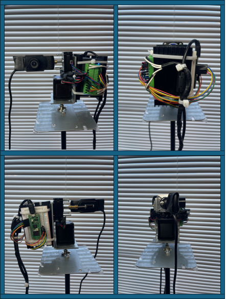

# Camera Tracking
## Purpose
This project explores the intersection of machine learning and physical infrastructure. It involves a comprehensive system that leverages various components such as Bluetooth Low Energy (BLE), motor control, webcam configuration, and more to demonstrate how machine learning can be applied to control and optimize physical systems.

## Physical Infrastructure (Rig)
### Raspberry Pi Pico W
**Role:** Serves as the central microcontroller unit (MCU) for the project. 
**Functionality:** Handles the execution of Python scripts, management of Bluetooth connectivity, and communication with other hardware components like motors and the webcam. It's equipped with Wi-Fi capabilities which are useful for remote monitoring and control tasks.

### 12V Stepper Motors
**Quantity:** 2 
**Role:** Responsible for the mechanical movement in the project. 
**Functionality:** These motors provide precise control over mechanical actions, crucial for tasks that require exact positioning and movement, such as robotics arms or moving parts of an installation.

### Stepper Motor Drivers
**Role:** Interface between the Raspberry Pi Pico W and the stepper motors. 
**Functionality:** These drivers take commands from the microcontroller and supply the stepper motors with the necessary power to perform movements. They handle the current and voltage requirements of the stepper motors, ensuring smooth and accurate operation.

### Standard Webcam
**Role:** Acts as the visual sensor for the project. 
**Functionality:** Captures real-time video data, which can be used for various applications like monitoring, object detection, or interfacing with machine learning models for visual analysis.

### Laptop Charger (Power Supply)
**Role:** Provides power to the Raspberry Pi Pico W and possibly other components. 
**Functionality:** Ensures a stable and adequate power supply to the system, which is crucial for continuous and reliable operation of all electronic and mechanical parts.  

  

## Components Summary
### Configuration and Setup
**Configuration Files:** Scripts like configuration.py, gpu_config.py, and webcam_config.py handle the setup and configuration of the system's various hardware and software parameters, such as GPU settings and webcam resolutions. 
**BLE Configuration:** The ble_config.py script sets up parameters and utilities for Bluetooth operations, crucial for communication within the infrastructure.

### Main Operational Scripts
**Main Coordinator (main_coord.py):** Acts as the central script that coordinates various tasks and operations, processing inputs and controlling outputs based on system configurations and real-time data. 
**Robotics Control (main_robo.py):** Manages robotics-specific operations, integrating sensors and actuators with decision-making processes driven by machine learning insights.

### Device Communication and Control
**BLE Advertising and Detection:** Scripts ble_advertising.py and ble_detection.py manage the advertisement and detection of BLE devices, facilitating the wireless communication essential for remote operations. 
**Motor Control (motor_control.py):** Controls the motors based on commands derived from machine learning algorithms, adjusting movements to optimize task execution.

### Utilities and Shared Resources
**Shared Variables (shared_variables.py):** Manages shared resources and variables that are used across different scripts, ensuring consistent and synchronized operations.

## Project Rationale
This project was driven by a fascination with how machine learning can enhance and interact with physical infrastructures. By integrating intelligent algorithms with physical components, the project demonstrates potential improvements in automation, efficiency, and functionality in real-world applications.
